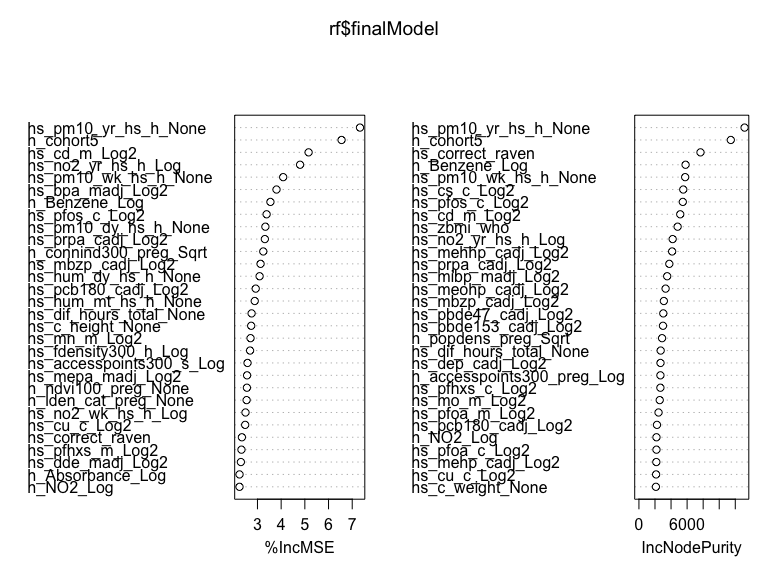

ml_hw10
================
Mohammad
2023-04-04

### Data preparation

First we load the `exposome` data file then merge `exposome` and
`phenotype` data sets, then remove the `ID` variable. Next, we partition
the data into training and testing data (70/30 split)

``` r
#Load data using path of where file is stored
load("/Users/mofouda/Desktop/Spring 23/Machine learning/Assignmets/hw10/ml_hw10/data/exposome.RData")

#Merge all data frames into a single data frame
studydata <- 
    merge(exposome, phenotype, by="ID") %>% 
    merge(covariates, by="ID") %>% 
    select(-ID)

#Partition data for use in demonstration
set.seed(123)

train.index <- 
    studydata$e3_bw %>% 
    createDataPartition(p = 0.7, list = FALSE)

train_df <- 
    studydata[train.index, ]

test_df <- 
    studydata[-train.index, ]
```

### Step 1: Data Exploration of Training Data

In this step we perform some data exploration by providing some
descriptive measures (for continuous measures: means and ranges, for
categorical/binary: frequency counts), examining correlations between
features, examining missingness.

The `studydata` dataframe has 1301 observations and 241 features.

``` r
str(studydata)
```

    ## 'data.frame':    1301 obs. of  241 variables:
    ##  $ h_abs_ratio_preg_Log        : num  0.8967 0.8925 0.7787 0.0891 0.6048 ...
    ##  $ h_no2_ratio_preg_Log        : num  2.87 2.98 3.06 3.09 3.85 ...
    ##  $ h_pm10_ratio_preg_None      : num  25.9 25.9 26.1 15 35.2 ...
    ##  $ h_pm25_ratio_preg_None      : num  17.4 18.5 18.7 16.4 14.9 ...
    ##  $ hs_no2_dy_hs_h_Log          : num  2.53 1.93 2.88 1.39 3.2 ...
    ##  $ hs_no2_wk_hs_h_Log          : num  2.58 2.65 2.59 2.46 3.5 ...
    ##  $ hs_no2_yr_hs_h_Log          : num  2.61 2.76 2.36 2.4 3.31 ...
    ##  $ hs_pm10_dy_hs_h_None        : num  22.5 14.1 46.9 29.8 29.8 ...
    ##  $ hs_pm10_wk_hs_h_None        : num  20.9 29.1 31.5 25.2 24.9 ...
    ##  $ hs_pm10_yr_hs_h_None        : num  31.4 31.3 27.5 24 24.8 ...
    ##  $ hs_pm25_dy_hs_h_None        : num  16.95 11.16 28.45 4.62 14.92 ...
    ##  $ hs_pm25_wk_hs_h_None        : num  17 15.9 21.3 11 13.9 ...
    ##  $ hs_pm25_yr_hs_h_None        : num  18.4 17.7 16.8 12.7 13.4 ...
    ##  $ hs_pm25abs_dy_hs_h_Log      : num  0.0974 -0.4304 0.9156 -0.2833 0.9156 ...
    ##  $ hs_pm25abs_wk_hs_h_Log      : num  0.0712 0.2143 0.7197 -0.1387 -0.138 ...
    ##  $ hs_pm25abs_yr_hs_h_Log      : num  0.3211 0.2815 0.0987 0.1777 0.2205 ...
    ##  $ h_accesslines300_preg_dic0  : num  0 0 0 1 1 0 0 0 0 0 ...
    ##  $ h_accesspoints300_preg_Log  : num  1.96 2.37 1.27 4.53 3.06 ...
    ##  $ h_builtdens300_preg_Sqrt    : num  405 311 375 565 585 ...
    ##  $ h_connind300_preg_Sqrt      : num  1.89 6.54 6.26 14.49 18.68 ...
    ##  $ h_fdensity300_preg_Log      : num  10.3 10.3 10.3 13.8 12.2 ...
    ##  $ h_frichness300_preg_None    : num  0 0 0 0.2456 0.0877 ...
    ##  $ h_landuseshan300_preg_None  : num  0.364 0.401 0.288 0.633 0.459 ...
    ##  $ h_popdens_preg_Sqrt         : num  85 85 85 66.5 96.2 ...
    ##  $ h_walkability_mean_preg_None: num  0.175 0.2 0.15 0.35 0.275 0.35 0.2 0.225 0.175 0.375 ...
    ##  $ hs_accesslines300_h_dic0    : num  0 0 0 1 1 0 0 0 0 0 ...
    ##  $ hs_accesspoints300_h_Log    : num  1.675 2.774 0.577 4.584 3.621 ...
    ##  $ hs_builtdens300_h_Sqrt      : num  407 383 375 480 210 ...
    ##  $ hs_connind300_h_Log         : num  4.57 3.75 2.88 5.47 4.82 ...
    ##  $ hs_fdensity300_h_Log        : num  10.3 10.3 10.3 14 11 ...
    ##  $ hs_landuseshan300_h_None    : num  0.354 0.321 0.479 0.454 0.51 ...
    ##  $ hs_popdens_h_Sqrt           : num  84.99 10.25 10.25 66.54 4.56 ...
    ##  $ hs_walkability_mean_h_None  : num  0.375 0.2 0.25 0.525 0.3 0.375 0.3 0.325 0.275 0.525 ...
    ##  $ hs_accesslines300_s_dic0    : num  0 0 0 1 0 0 0 0 0 0 ...
    ##  $ hs_accesspoints300_s_Log    : num  0.577 2.186 2.186 3.285 2.186 ...
    ##  $ hs_builtdens300_s_Sqrt      : num  385 383.6 366.4 406.3 61.9 ...
    ##  $ hs_connind300_s_Log         : num  2.37 3.47 3.98 5.65 4.74 ...
    ##  $ hs_fdensity300_s_Log        : num  10.3 10.3 10.3 12.3 11 ...
    ##  $ hs_landuseshan300_s_None    : num  0.28 0.368 0.325 0.521 0.521 ...
    ##  $ hs_popdens_s_Sqrt           : num  84.99 84.99 84.99 25.71 4.56 ...
    ##  $ h_Absorbance_Log            : num  -0.1351 -0.0577 -0.4372 -0.8705 0.564 ...
    ##  $ h_Benzene_Log               : num  0.572 0.88 1.379 1.168 0.133 ...
    ##  $ h_NO2_Log                   : num  4.58 3.37 4.3 2.5 6.92 ...
    ##  $ h_PM_Log                    : num  2.6 2.33 2.33 1.66 3.62 ...
    ##  $ h_TEX_Log                   : num  2.53 2.84 2.88 2.67 3.43 ...
    ##  $ e3_alcpreg_yn_None          : Factor w/ 2 levels "0","1": 1 1 1 1 1 1 1 2 1 1 ...
    ##  $ h_bfdur_Ter                 : Factor w/ 3 levels "(0,10.8]","(10.8,34.9]",..: 1 1 3 2 2 3 1 3 1 1 ...
    ##  $ h_cereal_preg_Ter           : Factor w/ 3 levels "(0,9]","(9,27.3]",..: 1 1 2 3 1 3 2 1 3 1 ...
    ##  $ h_dairy_preg_Ter            : Factor w/ 3 levels "(0,17.1]","(17.1,27.1]",..: 3 3 3 1 1 3 3 2 1 3 ...
    ##  $ h_fastfood_preg_Ter         : Factor w/ 3 levels "(0,0.25]","(0.25,0.83]",..: 2 3 3 3 3 2 3 3 3 3 ...
    ##  $ h_fish_preg_Ter             : Factor w/ 3 levels "(0,1.9]","(1.9,4.1]",..: 3 3 3 1 3 3 1 2 2 2 ...
    ##  $ h_folic_t1_None             : Factor w/ 2 levels "0","1": 1 1 2 1 1 1 1 1 1 2 ...
    ##  $ h_fruit_preg_Ter            : Factor w/ 3 levels "(0,0.6]","(0.6,18.2]",..: 2 2 2 2 2 2 2 3 2 2 ...
    ##  $ h_legume_preg_Ter           : Factor w/ 3 levels "(0,0.5]","(0.5,2]",..: 3 3 3 3 2 3 2 3 2 3 ...
    ##  $ h_meat_preg_Ter             : Factor w/ 3 levels "(0,6.5]","(6.5,10]",..: 2 3 2 3 1 3 1 3 1 1 ...
    ##  $ h_pamod_t3_None             : Factor w/ 4 levels "None","Often",..: 4 1 2 2 4 4 3 2 2 4 ...
    ##  $ h_pavig_t3_None             : Factor w/ 3 levels "High","Low","Medium": 2 2 2 3 3 3 2 2 2 2 ...
    ##  $ h_veg_preg_Ter              : Factor w/ 3 levels "(0,8.8]","(8.8,16.5]",..: 2 2 2 1 2 2 1 1 2 1 ...
    ##  $ hs_bakery_prod_Ter          : Factor w/ 3 levels "(0,2]","(2,6]",..: 2 1 2 3 2 2 3 3 3 3 ...
    ##  $ hs_beverages_Ter            : Factor w/ 3 levels "(0,0.132]","(0.132,1]",..: 3 2 2 1 2 1 3 1 1 3 ...
    ##  $ hs_break_cer_Ter            : Factor w/ 3 levels "(0,1.1]","(1.1,5.5]",..: 1 1 2 3 2 3 2 2 3 3 ...
    ##  $ hs_caff_drink_Ter           : Factor w/ 2 levels "(0,0.132]","(0.132,Inf]": 1 2 2 1 1 1 2 1 1 1 ...
    ##  $ hs_dairy_Ter                : Factor w/ 3 levels "(0,14.6]","(14.6,25.6]",..: 1 1 1 3 1 3 3 3 2 2 ...
    ##  $ hs_fastfood_Ter             : Factor w/ 3 levels "(0,0.132]","(0.132,0.5]",..: 2 2 2 2 2 1 2 3 3 3 ...
    ##  $ hs_KIDMED_None              : num  2 0 1 2 4 5 2 3 3 3 ...
    ##  $ hs_mvpa_prd_alt_None        : num  47.89 31.83 117.58 -2.03 -7.85 ...
    ##  $ hs_org_food_Ter             : Factor w/ 3 levels "(0,0.132]","(0.132,1]",..: 2 3 2 2 1 3 2 1 3 1 ...
    ##  $ hs_pet_cat_r2_None          : Factor w/ 2 levels "0","1": 1 1 1 2 1 1 2 1 1 2 ...
    ##  $ hs_pet_dog_r2_None          : Factor w/ 2 levels "0","1": 1 1 1 1 2 1 1 1 1 1 ...
    ##  $ hs_pet_None                 : Factor w/ 2 levels "No","Yes": 2 1 1 2 2 2 2 1 2 2 ...
    ##  $ hs_proc_meat_Ter            : Factor w/ 3 levels "(0,1.5]","(1.5,4]",..: 2 2 3 1 3 3 2 2 1 1 ...
    ##  $ hs_readymade_Ter            : Factor w/ 3 levels "(0,0.132]","(0.132,0.5]",..: 1 3 3 3 1 1 2 3 1 1 ...
    ##  $ hs_sd_wk_None               : num  389 523 446 180 454 ...
    ##  $ hs_total_bread_Ter          : Factor w/ 3 levels "(0,7]","(7,17.5]",..: 1 3 1 3 2 3 1 2 3 2 ...
    ##  $ hs_total_cereal_Ter         : Factor w/ 3 levels "(0,14.1]","(14.1,23.6]",..: 1 2 2 3 2 3 1 1 3 2 ...
    ##  $ hs_total_fish_Ter           : Factor w/ 3 levels "(0,1.5]","(1.5,3]",..: 1 1 1 2 3 3 1 2 2 2 ...
    ##  $ hs_total_fruits_Ter         : Factor w/ 3 levels "(0,7]","(7,14.1]",..: 3 1 1 3 3 3 1 2 3 3 ...
    ##  $ hs_total_lipids_Ter         : Factor w/ 3 levels "(0,3]","(3,7]",..: 3 3 3 2 3 2 1 3 3 3 ...
    ##  $ hs_total_meat_Ter           : Factor w/ 3 levels "(0,6]","(6,9]",..: 2 1 3 1 2 3 1 1 1 1 ...
    ##  $ hs_total_potatoes_Ter       : Factor w/ 3 levels "(0,3]","(3,4]",..: 3 2 2 1 1 3 1 3 1 3 ...
    ##  $ hs_total_sweets_Ter         : Factor w/ 3 levels "(0,4.1]","(4.1,8.5]",..: 1 3 3 3 1 3 1 2 3 2 ...
    ##  $ hs_total_veg_Ter            : Factor w/ 3 levels "(0,6]","(6,8.5]",..: 3 2 3 3 1 3 1 3 1 2 ...
    ##  $ hs_total_yog_Ter            : Factor w/ 3 levels "(0,6]","(6,8.5]",..: 1 1 1 3 1 3 3 2 1 1 ...
    ##  $ hs_dif_hours_total_None     : num  9.46 9.6 9.97 10.09 10.52 ...
    ##  $ hs_as_c_Log2                : num  -4.283 -6.43 -7.978 0.632 0.651 ...
    ##  $ hs_as_m_Log2                : num  -19.5 -9.58 -14.92 1.84 1.29 ...
    ##  $ hs_cd_c_Log2                : num  -4.14 -4.25 -4.05 -5.26 -3.75 ...
    ##  $ hs_cd_m_Log2                : num  -3.071 -2.599 -2.966 -0.935 -0.935 ...
    ##  $ hs_co_c_Log2                : num  1.02 -2.62 -2.56 -3 -1.61 ...
    ##  $ hs_co_m_Log2                : num  -4.08 -2.41 -2.63 -2.81 -0.55 ...
    ##  $ hs_cs_c_Log2                : num  0.251 0.202 0.39 0.669 0.903 ...
    ##  $ hs_cs_m_Log2                : num  0.151 -0.272 0.536 0.714 0.138 ...
    ##  $ hs_cu_c_Log2                : num  9.71 9.94 9.93 10.19 9.44 ...
    ##  $ hs_cu_m_Log2                : num  10.22 10.51 10.26 10.09 9.89 ...
    ##  $ hs_hg_c_Log2                : num  -2.152 -1.3 -0.911 1.48 2.862 ...
    ##  $ hs_hg_m_Log2                : num  -3.1203 -1.0233 0.0841 2.211 3.2345 ...
    ##  $ hs_mn_c_Log2                : num  3.46 2.88 3 3.22 2.88 ...
    ##  $ hs_mn_m_Log2                : num  3.61 4.16 2.88 3.25 3.49 ...
    ##  $ hs_mo_c_Log2                : num  0.949 1.07 -0.484 -5.866 -0.252 ...
    ##   [list output truncated]

``` r
#Descriptive statistics
summaries <-
    studydata %>% 
    select(h_abs_ratio_preg_Log, hs_no2_dy_hs_h_Log, h_accesspoints300_preg_Log, hs_walkability_mean_h_None,
         h_Benzene_Log, h_NO2_Log, e3_alcpreg_yn_None, h_dairy_preg_Ter, h_meat_preg_Ter, h_pamod_t3_None,
         hs_cu_c_Log2, hs_pfoa_m_Log2, e3_asmokcigd_p_None, h_trafnear_preg_pow1over3, hs_wgtgain_None,
         e3_sex_None, h_edumc_None, hs_child_age_None,hs_asthma, hs_zbmi_who, hs_Gen_Tot, e3_bw) %>% 
    summary()

summaries
```

    ##  h_abs_ratio_preg_Log hs_no2_dy_hs_h_Log h_accesspoints300_preg_Log
    ##  Min.   :-0.47756     Min.   :0.3797     Min.   :1.270             
    ##  1st Qu.: 0.09776     1st Qu.:2.2867     1st Qu.:1.963             
    ##  Median : 0.30203     Median :2.9618     Median :2.879             
    ##  Mean   : 0.39089     Mean   :2.8307     Mean   :2.670             
    ##  3rd Qu.: 0.72516     3rd Qu.:3.4474     3rd Qu.:3.349             
    ##  Max.   : 1.70921     Max.   :5.1849     Max.   :4.528             
    ##  hs_walkability_mean_h_None h_Benzene_Log       h_NO2_Log    
    ##  Min.   :0.100              Min.   :-0.3296   Min.   :1.573  
    ##  1st Qu.:0.275              1st Qu.: 0.3141   1st Qu.:2.979  
    ##  Median :0.300              Median : 0.5600   Median :3.617  
    ##  Mean   :0.326              Mean   : 0.5987   Mean   :3.833  
    ##  3rd Qu.:0.375              3rd Qu.: 0.8437   3rd Qu.:4.576  
    ##  Max.   :0.600              Max.   : 1.9975   Max.   :7.093  
    ##  e3_alcpreg_yn_None    h_dairy_preg_Ter h_meat_preg_Ter   h_pamod_t3_None
    ##  0:896              (0,17.1]   :270     (0,6.5] :427    None      : 42   
    ##  1:405              (17.1,27.1]:380     (6.5,10]:387    Often     :474   
    ##                     (27.1,Inf] :651     (10,Inf]:487    Sometimes :191   
    ##                                                         Very Often:594   
    ##                                                                          
    ##                                                                          
    ##   hs_cu_c_Log2    hs_pfoa_m_Log2    e3_asmokcigd_p_None
    ##  Min.   : 9.079   Min.   :-5.4760   Min.   : 0.000     
    ##  1st Qu.: 9.681   1st Qu.: 0.4107   1st Qu.: 0.000     
    ##  Median : 9.828   Median : 1.2007   Median : 0.000     
    ##  Mean   : 9.828   Mean   : 1.0479   Mean   : 0.494     
    ##  3rd Qu.: 9.966   3rd Qu.: 1.7450   3rd Qu.: 0.000     
    ##  Max.   :12.123   Max.   : 4.9836   Max.   :15.238     
    ##  h_trafnear_preg_pow1over3 hs_wgtgain_None e3_sex_None  h_edumc_None
    ##  Min.   : 0.000            Min.   : 0.0    female:608   1:178       
    ##  1st Qu.: 7.937            1st Qu.: 9.0    male  :693   2:449       
    ##  Median :12.119            Median :12.0                 3:674       
    ##  Mean   :14.989            Mean   :13.5                             
    ##  3rd Qu.:21.397            3rd Qu.:18.0                             
    ##  Max.   :39.321            Max.   :55.0                             
    ##  hs_child_age_None   hs_asthma       hs_zbmi_who        hs_Gen_Tot    
    ##  Min.   : 5.437    Min.   :0.0000   Min.   :-3.5800   Min.   :  0.00  
    ##  1st Qu.: 6.500    1st Qu.:0.0000   1st Qu.:-0.4000   1st Qu.: 10.00  
    ##  Median : 8.033    Median :0.0000   Median : 0.2800   Median : 20.00  
    ##  Mean   : 7.976    Mean   :0.1091   Mean   : 0.4032   Mean   : 24.38  
    ##  3rd Qu.: 8.920    3rd Qu.:0.0000   3rd Qu.: 1.1300   3rd Qu.: 33.44  
    ##  Max.   :12.101    Max.   :1.0000   Max.   : 4.7200   Max.   :133.00  
    ##      e3_bw     
    ##  Min.   :1100  
    ##  1st Qu.:3080  
    ##  Median :3398  
    ##  Mean   :3389  
    ##  3rd Qu.:3720  
    ##  Max.   :5260

``` r
#Examine Missingness
Amelia::missmap(studydata)
```


``` r
#Examine correlations between features
cor_studydata <-
    studydata %>% 
    select(where(is.numeric)) %>% 
    cor(use = "complete.obs") %>% 
    findCorrelation(cutoff=0.4)
```

### Step 2: Research Question

A hypothesis-generating question we could explore using our data is:

Is there a correlation between maternal pre- and postnatal environmental
exposures and child neurological behavior aged 6-11 years?

### Step 3: Implement pipeline to address research question

Using a random forest algorithm to train the model for feature
selection. We can get the most important variable in predicting the
neurological behavior in children aged 6-11 years. We can then use this
data to generate a hypothesis regarding these environmental exposures
and neuro hehavior outcomes in children.

This code chunk uses different combinations of the features in the
`studydata` dataset to train the model. We run 200 trees in this model.
Variable number of trees could be used to train the model to get the
best model. However, computational capacity is a limitation so we
restrict to 200 trees only. We use Roomt Mean Square Error to evaluate
the model since this is a regression problem.

``` r
# Try mtry of all, half of all, sqrt of all, 
mtry <- 
    c(ncol(train_df)-1, sqrt(ncol(train_df)-1), 0.5*ncol(train_df)-1)

mtrygrid <- 
    expand.grid(.mtry = round(mtry))

control <- 
    trainControl(method = "cv", number = 10)

set.seed(123)
    rf <- 
        train(hs_Gen_Tot ~., data = train_df, method = "rf", preProc=c("center", "scale"), 
              trControl = control, metric = "RMSE", tuneGrid = mtrygrid, importance = TRUE, ntree = 200)

rf$results
```

    ##   mtry     RMSE  Rsquared      MAE   RMSESD RsquaredSD    MAESD
    ## 1   15 17.73645 0.1550397 13.46433 1.765867 0.07137011 1.040905
    ## 2  120 17.64688 0.1604324 13.36714 1.685357 0.06505855 1.038523
    ## 3  240 17.79705 0.1506898 13.46285 1.820752 0.06374355 1.156041

``` r
varImp(rf)
```

    ## rf variable importance
    ## 
    ##   only 20 most important variables shown (out of 296)
    ## 
    ##                          Overall
    ## hs_pm10_yr_hs_h_None      100.00
    ## h_cohort5                  92.01
    ## hs_cd_m_Log2               77.70
    ## hs_no2_yr_hs_h_Log         74.00
    ## hs_pm10_wk_hs_h_None       66.67
    ## hs_bpa_madj_Log2           63.78
    ## h_Benzene_Log              61.14
    ## hs_pfos_c_Log2             59.48
    ## hs_pm10_dy_hs_h_None       58.95
    ## hs_prpa_cadj_Log2          58.72
    ## h_connind300_preg_Sqrt     58.03
    ## hs_mbzp_cadj_Log2          56.86
    ## hs_hum_dy_hs_h_None        56.44
    ## hs_pcb180_cadj_Log2        54.75
    ## hs_hum_mt_hs_h_None        54.33
    ## hs_dif_hours_total_None    52.97
    ## hs_c_height_None           52.79
    ## hs_mn_m_Log2               52.50
    ## hs_fdensity300_h_Log       52.31
    ## hs_accesspoints300_s_Log   51.20

``` r
rf$finalModel
```

    ## 
    ## Call:
    ##  randomForest(x = x, y = y, ntree = 200, mtry = param$mtry, importance = TRUE) 
    ##                Type of random forest: regression
    ##                      Number of trees: 200
    ## No. of variables tried at each split: 120
    ## 
    ##           Mean of squared residuals: 321.4377
    ##                     % Var explained: 12.85

``` r
varImpPlot(rf$finalModel)
```



### Model Evaluation in test

We then use the model to evaluate the performance in the test dataset.

``` r
set.seed(123)

predictions <- predict(rf, test_df)
RMSE(predictions, test_df$hs_Gen_Tot)
```

    ## [1] 17.72965
